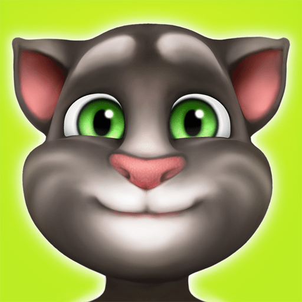

<a id="readme-top"></a>


<!-- PROJECT LOGO -->
<br />
<div align="center">
    
  <h3 align="center">talking-tom</h3>
  <p align="center">
    A Chat Application with Totally Ordered Multicast Simulation.
  </p>
</div>


<!-- ABOUT THE PROJECT -->
## About

This project was developed as one of the assignments in the Distributed Systems class of my Master's degree at FCUP.

<p align="right">(<a href="#readme-top">back to top</a>)</p>

## Assignment

- Create a network of 6 peers (p1 to p6) each in a different machine (m1 to m6) with the topology shown in the figure above. Each peer has a table with the IP addresses of all the other peers/machines.

- Implement Lamport clocks in each peer so that messages can be adequately timestamped.

- Each peer sends a random word according to a Poisson distribution with a frequency of 1 per second. You can use a text format dictionary from the Internet and extract its keywords into a set. Then choose a random keyword from that set. Each word is sent in a message to all other peers (they are all in the IP table).

- The goal is that all peers print the same sequence of words. To do this, the peers must agree on a global order for the messages before processing them (print the words therein). This is not trivial, as factors such as communication latency and varying network topology affect message delivery even in small networks.

- To achieve this, you must implement the Totally-Ordered Multicast (TOM) Algorithm using Lamport clocks to timestamp the messages. Check Chapter 6 of van Steen and Tanenbaum for the details of the algorithm and here for another, detailed, description).

- Note that in TOM there is a difference between receiving and processing a message. Processes always receive incoming messages, but they are processed only when specific conditions are met. In this application, peers process messages by printing the words therein. If you correctly implemented the TOM algorithm the printed list of words must be the same for all peers.

- **[EXTRA MARKS:]** Design and implement a mechanism that allows the distributed system to detect and prevent malicious peers from trying to compromise the protocol by: (a) "rewriting history" using an already used timestamp value; (b) "writing in the future" using a timestamp larger than the one expected.

<p align="right">(<a href="#readme-top">back to top</a>)</p>


### Built With

These are some of the tools used to build this project.

* `rand` for random number generation.
* `serde` for json serialization and deserialization.
* `tonic` for gRPC communication between peers.
* `clap` for command-line argument passing.
* `color-print` for making it look nice.

<p align="right">(<a href="#readme-top">back to top</a>)</p>

<!-- GETTING STARTED -->
## Getting Started

### Prerequisites

In order to run build this application from source you will need to have `cargo`, `protobuf compiler` installed.

<p align="right">(<a href="#readme-top">back to top</a>)</p>

### Installation
1. Clone the repository
   ```sh
   git clone https://github.com/diogogomesaraujo/talking-tom.git
   ```
2. Build the project
   ```sh
   cargo build
   ```

<p align="right">(<a href="#readme-top">back to top</a>)</p>

### Run the Project
1. Navigate to the project's directory
2. Create a `config.txt` file with unique addresses (IP and port) for the N peers you want the network to have (one for each line).
3. Run the following command for all peers (execute for every number between 0 and N - 1).
   
   ```sh
   cargo run -- <PEER_INDEX>
   ```

#### Example
   ```sh
   # config.txt
   127.0.0.1:3000
   127.0.0.1:3001
   127.0.0.1:3002

   # peers
   cargo run -- 0
   cargo run -- 1
   cargo run -- 2
   ```

<p align="right">(<a href="#readme-top">back to top</a>)</p>


<!-- MARKDOWN LINKS & IMAGES -->
<!-- https://www.markdownguide.org/basic-syntax/#reference-style-links -->
[contributors-shield]: https://img.shields.io/github/contributors/othneildrew/Best-README-Template.svg?style=for-the-badge
[contributors-url]: https://github.com/othneildrew/Best-README-Template/graphs/contributors
[forks-shield]: https://img.shields.io/github/forks/othneildrew/Best-README-Template.svg?style=for-the-badge
[forks-url]: https://github.com/othneildrew/Best-README-Template/network/members
[stars-shield]: https://img.shields.io/github/stars/othneildrew/Best-README-Template.svg?style=for-the-badge
[stars-url]: https://github.com/othneildrew/Best-README-Template/stargazers
[issues-shield]: https://img.shields.io/github/issues/othneildrew/Best-README-Template.svg?style=for-the-badge
[issues-url]: https://github.com/othneildrew/Best-README-Template/issues
[license-shield]: https://img.shields.io/github/license/othneildrew/Best-README-Template.svg?style=for-the-badge
[license-url]: https://github.com/othneildrew/Best-README-Template/blob/master/LICENSE.txt
[linkedin-shield]: https://img.shields.io/badge/-LinkedIn-black.svg?style=for-the-badge&logo=linkedin&colorB=555
[linkedin-url]: https://linkedin.com/in/othneildrew
[product-screenshot]: images/screenshot.png
[Next.js]: https://img.shields.io/badge/next.js-000000?style=for-the-badge&logo=nextdotjs&logoColor=white
[Next-url]: https://nextjs.org/
[React.js]: https://img.shields.io/badge/React-20232A?style=for-the-badge&logo=react&logoColor=61DAFB
[React-url]: https://reactjs.org/
[Vue.js]: https://img.shields.io/badge/Vue.js-35495E?style=for-the-badge&logo=vuedotjs&logoColor=4FC08D
[Vue-url]: https://vuejs.org/
[Angular.io]: https://img.shields.io/badge/Angular-DD0031?style=for-the-badge&logo=angular&logoColor=white
[Angular-url]: https://angular.io/
[Svelte.dev]: https://img.shields.io/badge/Svelte-4A4A55?style=for-the-badge&logo=svelte&logoColor=FF3E00
[Svelte-url]: https://svelte.dev/
[Laravel.com]: https://img.shields.io/badge/Laravel-FF2D20?style=for-the-badge&logo=laravel&logoColor=white
[Laravel-url]: https://laravel.com
[Bootstrap.com]: https://img.shields.io/badge/Bootstrap-563D7C?style=for-the-badge&logo=bootstrap&logoColor=white
[Bootstrap-url]: https://getbootstrap.com
[JQuery.com]: https://img.shields.io/badge/jQuery-0769AD?style=for-the-badge&logo=jquery&logoColor=white
[JQuery-url]: https://jquery.com
